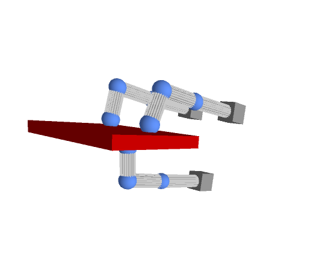
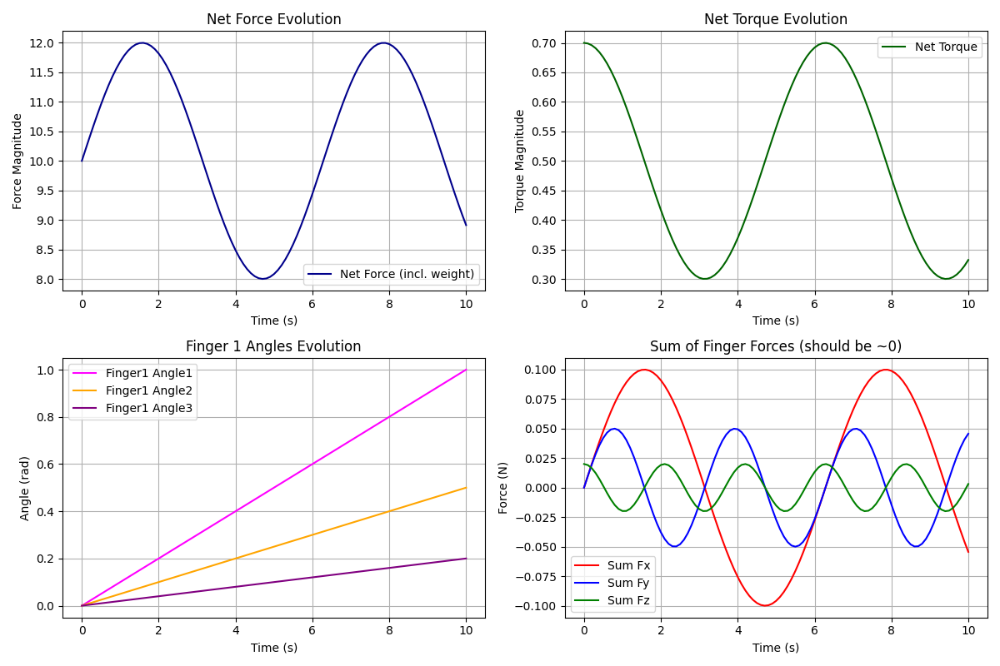

# Dexterous Manipulation

##### Dexterous Manipulation using Processing IDE and Python. 

## Overview

This project presents a 3D simulation of a robotic hand equipped with three fingers, each having three degrees of freedom, designed for securely gripping and moving a block while maintaining stability. It employs computational simulation to evaluate the robot's performance and optimize functionality before physical implementation.

## Features 
- 3D Simulation: Interactive visualization of the robotic hand and object manipulation using Processing IDE.
- Real-Time Dynamics: Calculation and real-time monitoring of forces, torques, and kinematic parameters using Python.
- Kinematic and Dynamic Analysis: Implementation of forward and inverse kinematics with a numerical Jacobian approach.
- Force and Torque Analysis: Calculation of grip stability considering forces, torques, gravity, inertia, and friction.
- Denavit-Hartenberg Parameters: Standardized robotic description facilitating precise kinematic modeling.

## Technologies Used

- Processing IDE: Real-time 3D simulation and interactive visualization.
- Python: Numerical computations, real-time plotting, and dynamic analysis of kinematic and dynamic parameters.

## Gallery

